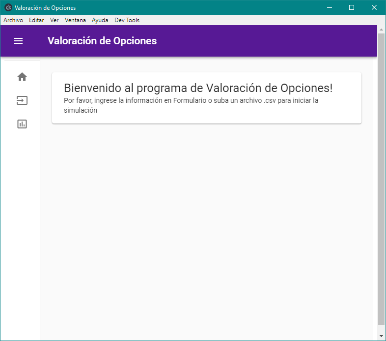
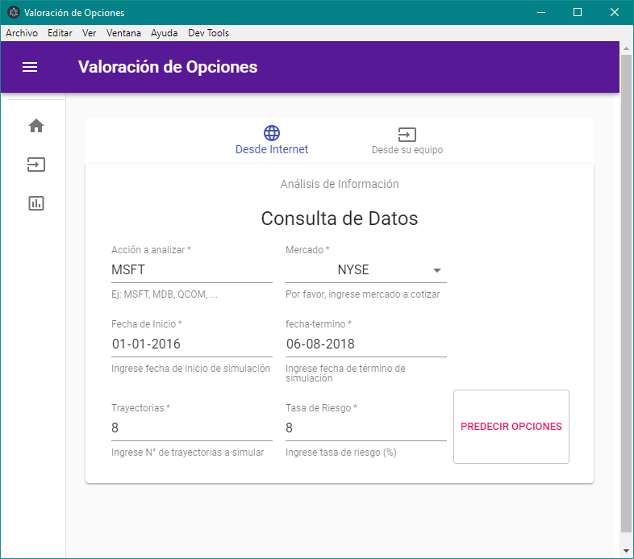
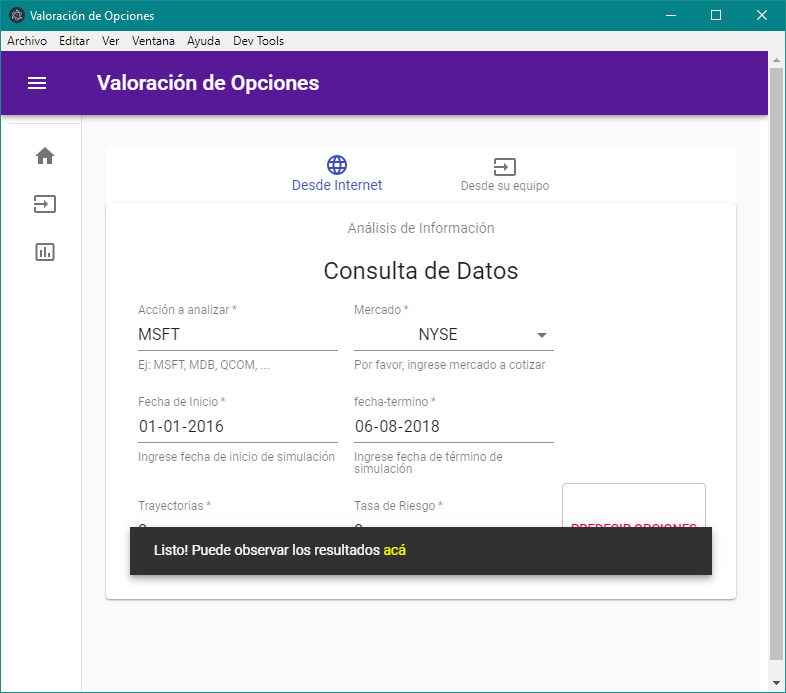
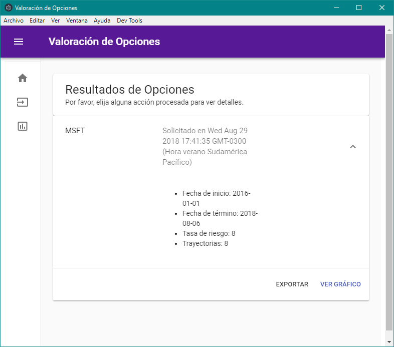
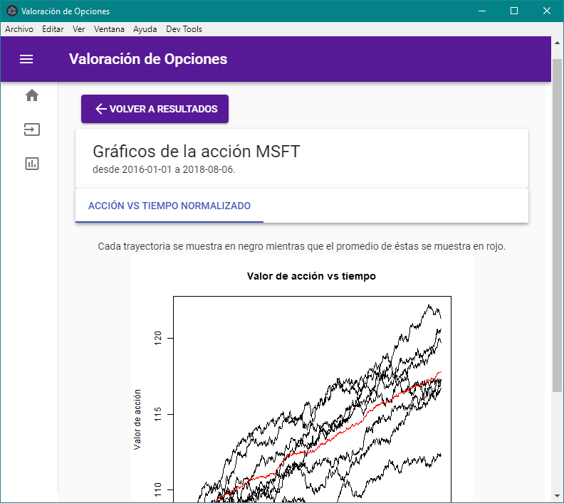
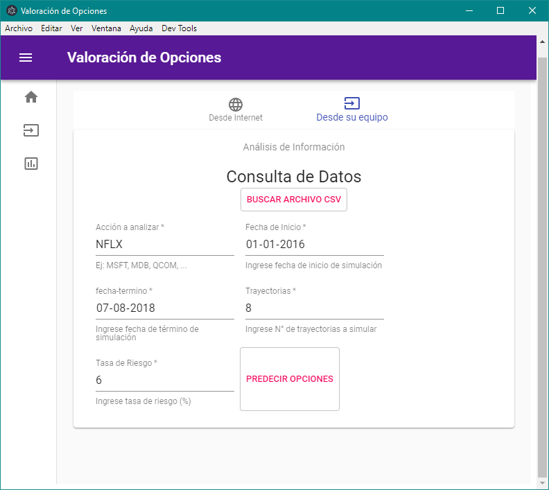
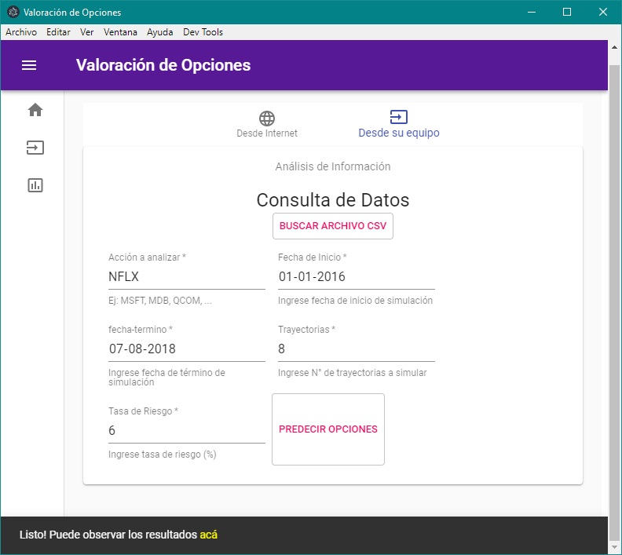
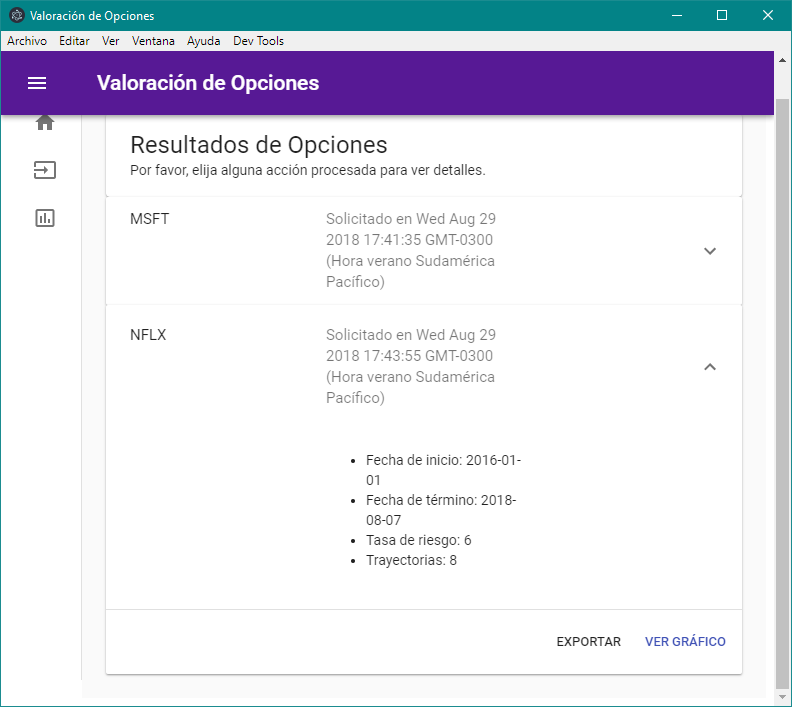
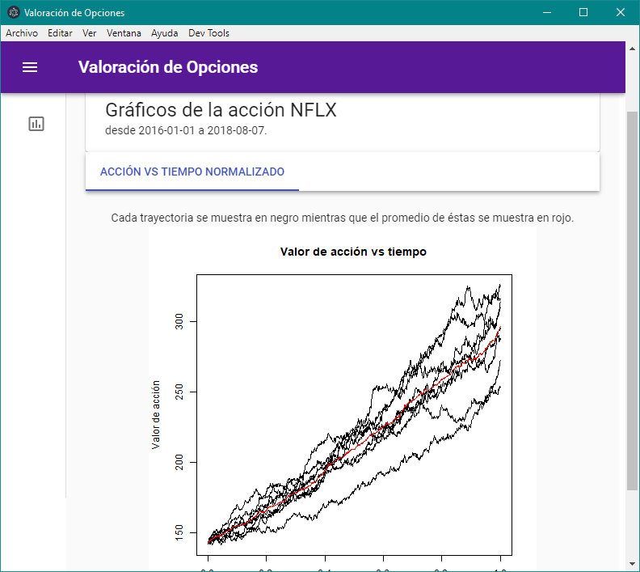

# "Valoración de Opciones sobre Acciones" - Source Code

El programa consta de un programa desarrollado en ReactJS, Express y Electron, además de una API local de R que permite analizar los datos extraidos desde Yahoo Finance o de un archivo local.

### Instalación 
Instalación de dependencias:
```bash
npm install
```

Instalación de R y dependencias necesarias:
```bash
apt-get update
apt-get install r-base r-base-dev r-cran-rgl g++
```

### Compilación del programa:
```bash
npm run build
```
### Ejecución del programa

  Primeramente, ejecute la API local de R (**NOTA:** La primera vez que se ejecute se demorará, ya que instalará los paquetes necesarios antes de ejecutar la API).

Linux/MacOS:
```bash
- sudo Rscript main.R
```

Windows (ejecutar consola con permisos de administrador):
```bash
- Rscript main.R
```
Para el caso de Windows, procure agregar los ejecutables de R a la variable PATH. Dichos ejecutables se encuentran, por lo general, en la ruta C:\Program Files\R\R-\<version\>\bin\x64

  Luego, ejecute el programa principal mediante los siguientes comandos:

Windows: 

```bash
.\node_modules\.bin\electron .
```
Linux/MacOS: 
```bash 
electron . 
```

### Funcionamiento


*Figura 1: Pantalla principal de la aplicación*

*Figura 2: Solicitud de calculo de opciones de forma online*

*Figura 3: Solicitud de calculo de opciones de forma online lista*

*Figura 4: Acción analizada de forma online en la vista de resultados*

*Figura 5: Gráfico acción vs tiempo normalizado*

*Figura 6: Solicitud de calculo de opciones de forma local*

*Figura 7: Solicitud de calculo de opciones de forma local lista*

*Figura 8: Acción analizada de forma local en la vista de resultados*

*Figura 9: Gráfico acción vs tiempo normalizado*

El archivo de prueba está en la carpeta RAPI, llamado NFLX.csv.